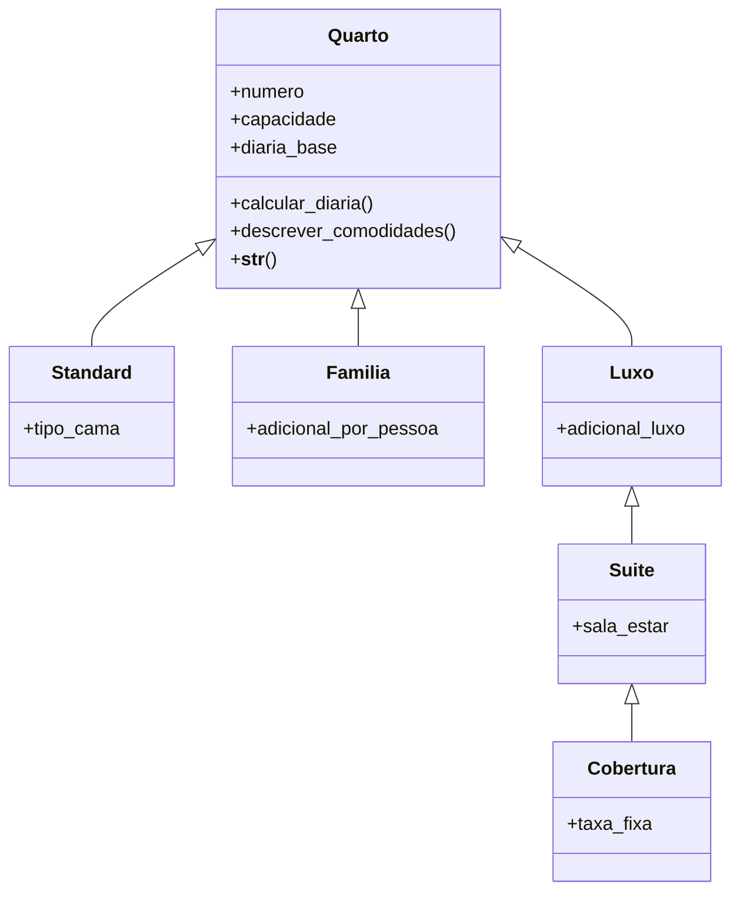

# Diagrama UML

```mermaid
classDiagram

class Quarto{
    +numero
    +capacidade
    +diaria_base
    +calcular_diaria()
    +descrever_comodidades()
    +__str__()
}

class Standard{
    +tipo_cama
}

class Familia{
    +adicional_por_pessoa
}

class Luxo{
    +adicional_luxo
}

class Suite{
    +sala_estar
}

class Cobertura{
    +taxa_fixa
}

Quarto <|-- Standard
Quarto <|-- Familia
Quarto <|-- Luxo
Luxo <|-- Suite
Suite <|-- Cobertura
```